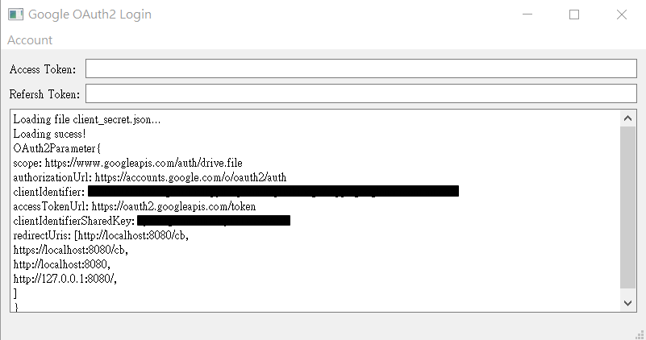

# Qt-Google-OAuth2-Demo

Use QOAuth2AuthorizationCodeFlow class implement Google OAuth2 login and refresh token

## ScreenShot



## How to Build

**Step 1: Apply an Google Drive Api and download api settings file**

In [google api console][ref 1], select your api > credentials > download your client_secret_xxx.json


The file will look like these:

``` json
{
    "web": {
        "client_id": "YOUR_CLIENT_ID",
        "project_id": "dogwood-harmony-666666",
        "auth_uri": "https://accounts.google.com/o/oauth2/auth",
        "token_uri": "https://oauth2.googleapis.com/token",
        "auth_provider_x509_cert_url": "https://www.googleapis.com/oauth2/v1/certs",
        "client_secret": "YOUR_CLIENT_SECRET",
        "redirect_uris": [
            "http://localhost:8080/cb"
        ]
    }
}
```

**Step 2: Download and compile Project**

**Step 3: Rename the json file to client_secret.json,then put in complied folder**

## How to use

這裡是教你如何開發自己的Google OAuth2 登入所需的應用程序。

這裡不會教授OAuth2的原理與參數。

首先你必須使用自己的google帳號申請一個Google網路服務api，不論是Drive/Map/Youtube/...都是一樣的步驟。

當你申請完後可以試著使用[Google OAuth playground][ref 2]確認API是否正常運作。

接著你可以到[google api console][ref 1]下載包含API參數的json檔。

開啟一個新的專案(假設名為MyApp)，在`Myapp.pro`添加network與networkauth模組:

``` pro
QT += network networkauth
```

接著來到程式部分，我們必須引入幾個類別:

``` c++
#include <QNetworkAccessManager>
#include <QOAuth2AuthorizationCodeFlow>
#include <QOAuthHttpServerReplyHandler>
```

`QNetworkAccessManager` 是一個負責發送network socket的類別
`QOAuth2AuthorizationCodeFlow` 負責處理發送OAuth2認證
`QOAuthHttpServerReplyHandler` 負責開啟一個伺服器處理OAuth2流程

接著我們載入參數，我們共需要以下幾個參數:

```c++
struct OAuth2Parameter{
    QString scope;
    QUrl authorizationUrl;
    QString clientIdentifier;
    QUrl accessTokenUrl;
    QString clientIdentifierSharedKey;
    QList<QUrl> redirectUris;
}
```

這裡你可以自行填入對應的值(hardcode)或讀取json檔的方式獲取。

接著我們初始化`QOAuth2AuthorizationCodeFlow`物件，並填入對應的參數。
`QOAuthHttpServerReplyHandler`會開啟一個local server負責監聽對應的port並與google伺服器交換認證必要的資訊。
`setModifyParametersFunction()`負責修改OAuth2認證流程的參數，這裡我們後面再詳談。

``` c++
// setup QOAuth2AuthorizationCodeFlow
auto manager = new QNetworkAccessManager(parent);
auto google = new QOAuth2AuthorizationCodeFlow(manager,parent);
google->setScope(parameter.scope);
google->setAuthorizationUrl(parameter.authorizationUrl);
google->setClientIdentifier(parameter.clientIdentifier);
google->setAccessTokenUrl(parameter.accessTokenUrl);
google->setClientIdentifierSharedKey(parameter.clientIdentifierSharedKey);
/* reset Oauth parameter to fit Google OAuth situation */
google->setModifyParametersFunction(buildModifyParametersFunction(parameter.clientIdentifier,parameter.clientIdentifierSharedKey));

auto port = parameter.redirectUris[0].port();
auto replyHandler = new QOAuthHttpServerReplyHandler(port, parent);
google->setReplyHandler(replyHandler);
```

設定好`QOAuth2AuthorizationCodeFlow`的初始化，我們還需要做兩個slot負責處理:

``` c++
// initialize m_google = QOAuth2AuthorizationCodeFlow(...)
connect(m_google,&QOAuth2AuthorizationCodeFlow::authorizeWithBrowser,
        this,&MainWindow::onGoogleAuthorizeWithBrowser);
connect(m_google,&QOAuth2AuthorizationCodeFlow::granted,
        this,&MainWindow::onGoogleGranted);

void MainWindow::onGoogleAuthorizeWithBrowser(const QUrl &url)
{
    QDesktopServices::openUrl(url);
}

void MainWindow::onGoogleGranted()
{
    qDebug() << "Token:" << m_google->token();
    qDebug() << "Refresh token:" << m_google->refreshToken();
}
```

第一個slot函數裡，`void QAbstractOAuth::authorizeWithBrowser(const QUrl &url)`會發送一個Url參數，你在接收後必須呼叫瀏覽器開啟該Url執行整個認證的初始過程，在這裡我使用`QDesktopServices::openUrl()`來打開預設瀏覽器，你也可以使用其他Api或是無頭瀏覽器來執行整個過程。

第二個slot函數負責在認證流程完成後處理更新UI的工作(或是其他你想做的事)，使用`QString QAbstractOAuth::token() const`與`QString QAbstractOAuth2::refreshToken() const`取得對應的值。

開啟認證流程只要呼叫`void QOAuth2AuthorizationCodeFlow::grant()`即可，你可以自行選擇使用按鈕、快速鍵、或任意方式觸發此函數。

更新access token:
每家OAuth2 api所採用的token更新方式不同，有的並不會提供refresh token，而所需的參數不同。
以google而言，可以參考[Google identify platform][ref 3]的內容，簡而言之，當你開啟瀏覽器的時候，一般開啟的URL會如同這樣:

```
https://accounts.google.com/o/oauth2/auth?client_id={CLIENT_ID}&redirect_uri=http://127.0.0.1:8080/&response_type=code&scope=https://www.googleapis.com/auth/drive.file&state=aXDt5ZMJ
```

裡面包含client id,response type,redirect uri,scope的值，你必須加入`access_type=offline`，代表google伺服器必需提供refresh token，通常情況下只有使用者第一次使用你的api才會取得該refresh token。

``` 
https://accounts.google.com/o/oauth2/auth?access_type=offline&client_id={CLIENT_ID}&redirect_uri=http://127.0.0.1:8080/&response_type=code&scope=https://www.googleapis.com/auth/drive.file&state=aXDt5ZMJ
```

還記得我們之前看到的`void QAbstractOAuth::setModifyParametersFunction(const QAbstractOAuth::ModifyParametersFunction &modifyParametersFunction)`嗎?

這裡可以讓你對認證的流程進行細部的修改，這是一個靜態(static)的函數，在`QOAuth2AuthorizationCodeFlow`物件內部執行認證的過程中會調用此函數進行修改，你可以參考[這裡][ref 4]。

簡單來說，當我們需要在`QOAuth2AuthorizationCodeFlow::authorizeWithBrowser`發出的內容添加`access_type=offline`，需要這樣寫:

``` c++
void ModifyParametersFunction(QAbstractOAuth::Stage stage, QVariantMap *parameters){
    if(stage == QAbstractOAuth::Stage::RequestingAuthorization){
        parameters->insert("access_type","offline"); /* Request refresh token*/
        parameters->insert("prompt","consent"); /* force user check scope again */
    }
}
```

加入`prompt = consent`會強迫使用者確認授權的內容，這麼做也會導致每次登入時都可以讓你的程式拿到Refresh token。

到了這裡，你就可以在登入的時候取得refresh token，接著你可以在token過期的時候呼叫`void QOAuth2AuthorizationCodeFlow::refreshAccessToken()`來自動執行更新token的動作，你也可以把refresh token存檔，這樣一來，下次開啟你的程式的使用者只要呼叫`refreshAccessToken()`就可以取回token，等同於自動登入了。

等一下，其實事情還沒完，因為google伺服器額外要求你的app在更新token的同時[增加兩個參數][ref 5]，也就是client_id與client_secret，因此我們新增後`ModifyParametersFunction`如下:

``` c++
QAbstractOAuth::ModifyParametersFunction buildModifyParametersFunction(QUrl clientIdentifier,QUrl clientIdentifierSharedKey){
    return [clientIdentifier,clientIdentifierSharedKey]
            (QAbstractOAuth::Stage stage, QVariantMap *parameters){
        if(stage == QAbstractOAuth::Stage::RequestingAuthorization){
            parameters->insert("access_type","offline"); /* Request refresh token*/
            parameters->insert("prompt","consent"); /* force user check scope again */
        }
        if(stage == QAbstractOAuth::Stage::RefreshingAccessToken){
            parameters->insert("client_id",clientIdentifier);
            parameters->insert("client_secret",clientIdentifierSharedKey);
        }
    };
}
```

到了這裡你就可以在google取得token與refresh token並且更新token，have fun!

## Requirement

QT 5.15 higher

## Reference

[Connecting your Qt application with Google Services using OAuth 2.0](https://www.qt.io/blog/2017/01/25/connecting-qt-application-google-services-using-oauth-2-0)

[ref 1]:    https://console.developers.google.com/
[ref 2]:    https://developers.google.com/oauthplayground/
[ref 3]:    https://developers.google.com/identity/protocols/oauth2/web-server#creatingclient
[ref 4]:    https://doc.qt.io/qt-5/qabstractoauth.html#modifyParametersFunction
[ref 5]:    https://developers.google.com/identity/protocols/oauth2/web-server#offline